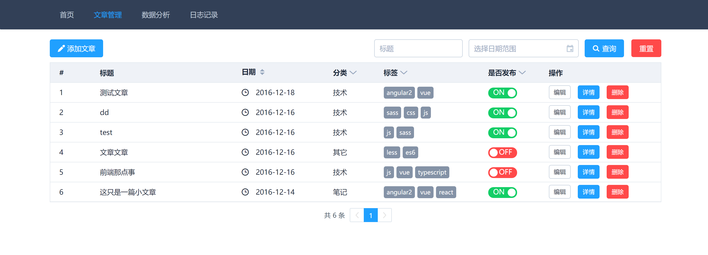
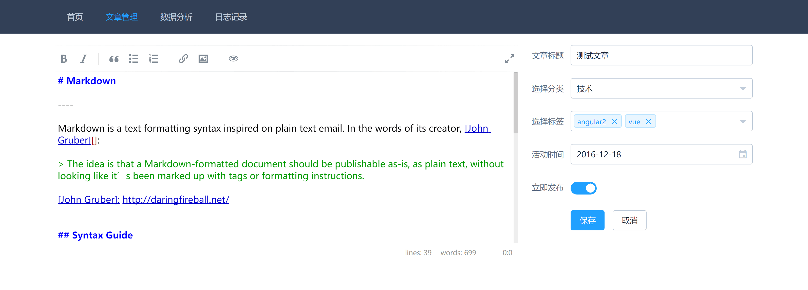

# management

> blog management project

## stack

vue + element + axios

## todo

- [x] 文章管理
- [x] 日志管理
- [x] 数据分析

## Build Setup

- run server

[api](https://github.com/Cacivy/koa-typescript)

- local

``` bash
# install dependencies
npm install

# serve with hot reload at localhost:8080
npm run dev

# build for production with minification
npm run build
```

##　Screenshots




## License

MIT. 

## Thanks

- [editor](https://github.com/lepture/editor)
- [CodeMirror](http://codemirror.net/)
- [element](http://element.eleme.io/)
- [marked](https://github.com/chjj/marked)
- [highlightjs](https://highlightjs.org/)